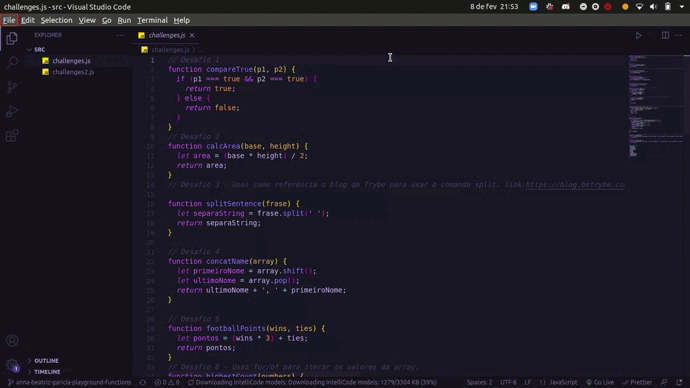

# Playground Functions

Segundo projeto desenvolvido no módulo de Fundamentos do Curso de Desenvolvimento Web da Trybe.

O projeto consistia em desenvolver funções utilizando conceitos da linguagem como a tipagem dinâmica e operadores lógicos/aritméticos de atribuição no código.

## 🚀 Tecnologia

- ⚡ JavaScript é uma linguagem de programação interpretada estruturada, de script em alto nível com tipagem dinâmica fraca e multiparadigma.

## ✋🏻 Pré-requisitos

- [git](https://git-scm.com/downloads): Ferramenta para gerenciar o código-fonte

- [Visual Studio Code](https://code.visualstudio.com/): Editor de Código Fonte
